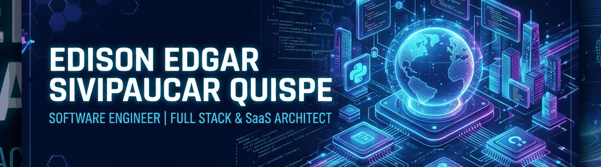
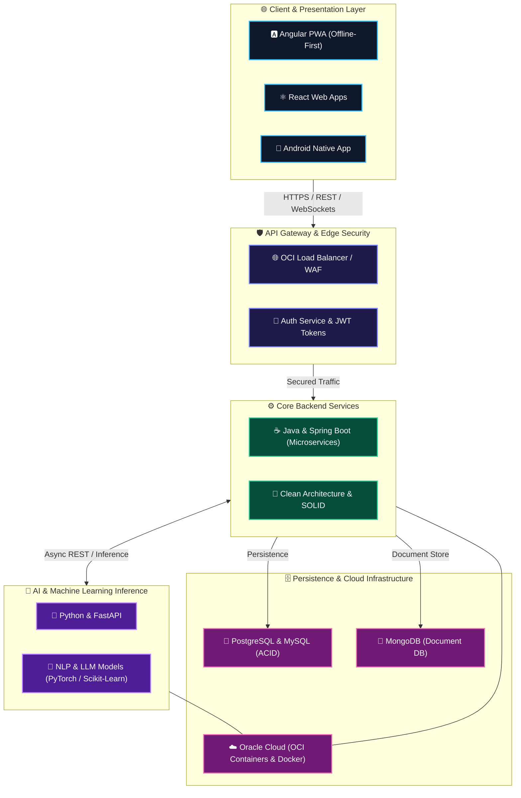

<div align="center">

  <!-- Futuristic Rectangular Animated GIF Banner -->
  

  <!-- Animated Typing SVG -->
  <a href="https://git.io/typing-svg">
    
  </a>

  <p align="center">
    <code><b>SOFTWARE ENGINEER</b></code> • <code><b>FULL STACK & SAAS ARCHITECT</b></code> • <code><b>JAVA / PYTHON & AI SPECIALIST</b></code>
  </p>

  <!-- Quick Contact Badges & Profile Views -->
  <p align="center">
    <a href="https://linkedin.com/in/edison-sivipaucar"></a>
    <a href="https://github.com/Edisonkz"></a>
    <a href="mailto:edisonsivipaucar@gmail.com"></a>
    
  </p>
</div>

---

### 🏆 GitHub Achievements & Trophies

<div align="center">
  <a href="https://github.com/ryo-ma/github-profile-trophy">
    
  </a>
</div>

---

### 💻 System Terminal Status

```bash
⚡ STATUS: Active & Engineering High-Impact Software
📍 LOCATION: Peru (UTC-5)
🚀 ROLE: Software Engineer | Full Stack & Systems Architect
🏛️ CORE ARCHITECTURE: Microservices | Event-Driven | Clean Architecture | SOLID | SaaS
🛠️ CORE BACKEND: Java (Spring Boot), Python (FastAPI) & Node.js
🌐 CORE FRONTEND: Angular (PWA), React & TypeScript
🤖 AI & ML ECOSYSTEM: LLM Architecture, RAG, NLP, PyTorch & LangChain
☁️ INFRASTRUCTURE: Oracle Cloud Infrastructure (OCI), Docker & CI/CD Pipelines
```

---

### 📐 End-to-End System Blueprint

<div align="center">



</div>

---

### 📈 Activity & Contribution Matrix

<div align="center">
  <a href="https://github.com/Ashutosh00710/github-readme-activity-graph">
    
  </a>
</div>

---

### 🛠️ Tech Stack & Ecosystem

#### ⚙️ Backend & Systems Engineering


#### 🌐 Frontend & Mobile Ecosystem


#### 🗄️ Database & Caching Layer


#### ☁️ Cloud, DevOps & CI/CD


#### 📐 Software Architecture & Governance


#### 🤖 AI, LLM & Machine Learning Ecosystem


---

### 🌟 Featured Systems & Architectures

<details open>
<summary><b>1. Plataforma Empresarial Inteligente (Distributed Microservices)</b></summary>
<br />

> **Arquitectura modular de microservicios de grado empresarial** con integración de Inteligencia Artificial para inferencia y análisis predictivo en tiempo real.

- **Architecture & Stack**: Java, Spring Boot, Angular, Oracle Cloud (OCI), Docker Containers, Microservices, PostgreSQL, AI Engine.
- **Key Engineering Highlights**:
  - Arquitectura distribuida desacoplada orientada a alta disponibilidad.
  - Orquestación en contenedores Docker y despliegue configurado sobre infraestructura OCI.
  - Endpoints REST securizados y módulos de procesamiento paralelo de datos.
</details>

<details open>
<summary><b>2. ProjectFlow (Multi-Tenant SaaS Platform)</b></summary>
<br />

> **Plataforma SaaS integral de gestión colaborativa de proyectos** dotada de un asistente inteligente, chat contextual por tarea y soporte PWA offline-first.

- **Architecture & Stack**: Spring Boot, Angular (PWA), PostgreSQL, AI Assistants & Predictive Weather API.
- **Key Engineering Highlights**:
  - PWA Offline-first con estrategia de sincronización asíncrona de datos.
  - Motor de chat interactivo por tarea y módulo de predicción meteorológica impulsado por IA.
  - Diseño multinquilino (Multi-tenant) preparado para escalabilidad SaaS commercial.
</details>

<details>
<summary><b>3. Sistema Inteligente de Control de Acceso (Biometric & Security System)</b></summary>
<br />

> **Plataforma de seguridad y gestión de asistencias integrando reconocimiento facial y QR dinámico.**

- **Architecture & Stack**: Java, Spring Boot, PostgreSQL, Android Native Client, Computer Vision / AI.
- **Key Engineering Highlights**:
  - Generación y autenticación criptográfica de códigos QR dinámicos.
  - Integración de pipeline de Reconocimiento Facial / IA para validación de identidad.
  - Backend centralizado consumido por clientes móviles Android en tiempo real.
</details>

<details>
<summary><b>4. Backend de Simulación & Inferencia IA (FastAPI Microservices)</b></summary>
<br />

> **Suite de microservicios asíncronos para inferencia de modelos NLP y analítica financiera.**

- **Architecture & Stack**: Python, FastAPI, NLP (Scikit-Learn / PyTorch), REST APIs.
- **Key Engineering Highlights**:
  - Mock API y Pipeline de Inferencia para Clasificador NLP de texto.
  - Endpoint analítico para predicción de salud financiera.
  - Arquitectura asíncrona optimizada para baja latencia en consumo desde clientes web.
</details>

<details>
<summary><b>5. Sistema Web de Gestión de Inventarios Multitienda</b></summary>
<br />

> **Sistema distribuido para control de stock, auditoría y gestión de almacenes multitienda.**

- **Architecture & Stack**: Java, Spring Boot, PostgreSQL, Clean Architecture.
- **Key Engineering Highlights**:
  - Control de stock multi-almacén con transacciones ACID en tiempo real.
  - Módulo de auditoría y generación de reportes analíticos.
  - Aplicación estricta de Clean Architecture / Patrón MVC.
</details>

---

### 🐍 Contribution Snake Stream

<div align="center">
  <picture>
    <source media="(prefers-color-scheme: dark)" srcset="https://raw.githubusercontent.com/Edisonkz/Edisonkz/output/github-contribution-grid-snake-dark.svg">
    <source media="(prefers-color-scheme: light)" srcset="https://raw.githubusercontent.com/Edisonkz/Edisonkz/output/github-contribution-grid-snake.svg">
    
  </picture>
</div>

---

### 📊 GitHub Engineering Analytics

<div align="center">
  <table border="0">
    <tr>
      <td>
        <a href="https://github.com/anuraghazra/github-readme-stats">
          
        </a>
      </td>
      <td>
        <a href="https://github.com/anuraghazra/github-readme-stats">
          
        </a>
      </td>
    </tr>
  </table>

  <br />

  <!-- Streak Stats Link Fixed -->
  <a href="https://github.com/DenverCoder1/github-readme-streak-stats">
    
  </a>
</div>

---

<div align="center">
  <!-- Futuristic Waving Bottom Banner -->
  

  <sub>Crafted with 💙 by <b>Edison Edgar Sivipaucar Quispe</b> | <i>Architecting Scalable Systems & Future Tech</i></sub>
</div>
